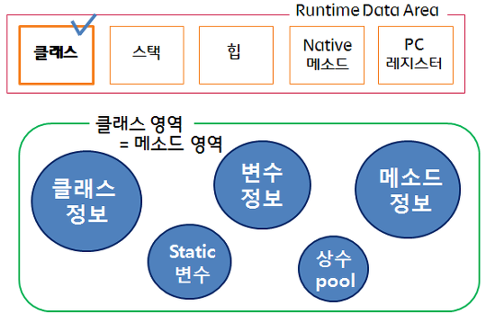
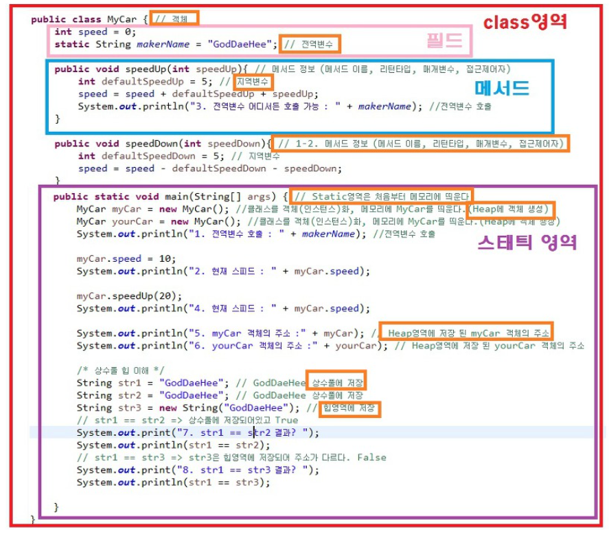

#JVM 메모리 구조  

JVM은 크게 4가지로 나뉜다.
**(Class Loader, Execution, Garbage Collector, Runtime Data Area)**
<br>
<br>


<br>
<br>

Java source 파일은 Java 컴파일러를 통해 class 파일로 컴파일 되며, 이 class 파일을 jvm이 구동하게 된다.

##Class Loader
- JVM이 class파일을 실행하면, 먼저 clas Loader가 실행된다. 그리고 class Loader는 Runtime Data Area로 메모리를적재한다.

##Execution Engine
- Class Loader에 의해 Runtime Data Araea에 적재된 ByteCode를 실행하는 Runtime Module이다. 이 떄 실행 방법엔 두 가지 방식이 있다.
    **1. Interpreter 방식.**
    최초 JVM이 나왔을 당시 썻던 방법으로, 한줄씩 해석하고 실행하는 방식이다. 속도가 느리다는 단점때문에 JIT방식을 통해 이 방식을 보완했다.
    **2. JIT 방식**
    JIT compiler는 ByteCode를 어셈블러 같은 NativeCode로 바꿔서 실행속도를 좀 더 빠르게 해준다. 하지만 역시 변환하는데 적지 않은 비용이 발생하므로, JVM은 모든 코드를 JIT Compiler 방식으로 실행하지 않고, Interpreter 방식을 사용하다 일정한 기준이 넘어가면 JIT Compiler 방식으로 실행한다.

##Garbage Collector

- Garbage Collector(GC)는 Heap 메모리 영역에 생성(적재)된 객체들 중에 참조되지 않은 객체들을 탐색 후 제거하는 역할을 한다.(Heap에서만 동작하는건 아니다.)
<br>
- GC가 동작하는 시간은 정확히 알 수 없다.
<br>
- 또 다른 특징은 GC가 실행되는 동안 GC를 수행하는 쓰레드가 아닌 다른 모든 쓰레드가 일시 정지된다. 특히 Full GC가 일어나 수 초간 모든 쓰레드가 정지한다면 장애로 이어지는 치명적인 문제가 생길 수 있다.

##Runtime Data Area
- JVM의 메모리 영역으로 자바 애플리케이션을 실행할 때 사용되는 데이터들을 적재하는 영역이다.
이 영역들은 크게 **Method Area, Heap Area, Stack Area, PC Register, Native Method Stack**으로 나눌 수 있다.
<br>
**1. Method Area**
- 클래스 멤버변수의 이름, 데이터 타입, 접근제어자 정보 같은 필드 정보
 >public int x = 0 에서 public, int, x

 - 메소드의 이름, 리턴 타입, 파라미터, 접근제어자 정보같은 메소드 정보
```
public void method( int num ) {
    System.out.println(num);
} // public, void, method, int num, 구현부
```
 - Type정보( Interface or Class)
<br>
 - Constant Pool(문자 상수, 타입, 필드, Methode reference, final class 의 변수)
 <br>
 - static 변수
 <br>
 - 이 정보들은 프로그램이 끝날 때 까지 메모리에 상주하게 된다.
 

 - 메소드 영역은 JVM이 동작해서 클래스가 로딩될 때 생성되고, 모든 쓰레드가 공유하는 영역이다.
<br>
##Heap Area
- new 키워드로 생성된 객체와 배열이 생성되는 영역
- 해당 영역에 생성된 객체와 배열은 JVM 스택 영역의 변수나 다른 객체의 필드에서 참조한다.
- 만약 참조하는 변수, 필드가 없으면 JVM이 Garbage Collector를 실행하여 해당 객체를 제거한다.
- 인스턴스의 실제 데이터가 이곳에 담긴다.


- 힙 영역은 GC의 주요 대상이다.(물론 stack, Method 영역도 GC의 대상)
- 힙 영역은 우선 5개의 영역(Eden, Survivor1, Survivor2, old, permanent)로 나뉜다.

- _JDK 8 버전부터 permanent 영역이 사라지고, Metaspace영역이 추가됐다.
permanent 영역은 JVM에 의해 크기가 강제되던 영역이고, Metaspace는 Native memory의 영역으로, OS가 자동으로 크기를 조절해 준다.
그 결과 기존에 비교해 큰 메모리 영역을 사용할 수 있게 됐다._
<br>
- 더 자세한 설명은 GC와 함께 아래에서 설명한다.


##Stack Area
- 지역변수, 파라미터, 리턴값, 연산에 사용되는 임시 값 등이 생성되는 영역이다.
```
int a = 10;
```
- 정수값이 할당될 수 있는 메모리공간을 a라고 잡고, 그 메모리 영역에 10이라는 값이 들어간다. 즉, Stack 영역에 이름이 a이고 값이 10, 공간의 크기를 a자료형크기만의 메모리 공간을 만든다.
```
Class c1 = new Class();
```
- c1은 스택영역에, 인스턴스는 힙 영역에 생성된다. 인스턴스의 주소값이 c1에 저장된다.

 - 메소드를 호출할 때 마다 그 메소드의 로컬 변수를 준비하고, 메소드 호출이 끝나면 그 메소드를 위해 준비했던 모든 변수가 스택에서 제거된다.
 - LIFO 구조이다.

 

##PC Register
- 쓰레드가 생성될 때마다 생성되는 영역으로 Program Counter 즉, 현재 쓰레드가 실행되는 부분의 주소와 명령을 저장하고 있는 영역이다.(CPU의 레지스터와 다르다).
이걸 이용해 쓰레드를 돌아가면서 수행할 수 있게 한다.

##Native method stack
- 자바 외 언어로 작성된 네이티브 코드를 위한 메모리 영역이다. 보통 C / C++ 등의 코드를 수행하기 위한 스택이다.

##Heap Area & GC
- 힙 영역은 GC의 주요 대상이다.(물론 Stack, Method영역도 GC의 대상이다.)

- 힙을 굳이 5개로 나눈 이유는 효율적으로 GC가 일어나게 하기 위함이다. GC는 Minor GC와 Major GC로 나뉜다.

1. **Minor GC (new 영역의 GC)**
    1. 최초의 객체가 생성되면 Eden영역에 생성된다.
    2. Eden영역에 객체가 가득 차게되면, 첫번째 GC가 일어난다.
    3. survivor1 영역에 Eden 영역의 메모리를 그대로 복사한다. 그리고 survivor1영역을 제외한 모든 객체를 제거한다.
    4. Eden영역과 survivor1 영역에 생성된 객체중에 참조되고 있는 객체가 있는지 검사한다.
    5. 참조되는 객체들만 survivor2 영역에 저장한다.(나머지는 삭제한다.)
    6. 위의 과정중 일정 횟수이상 참조되는 객체들을 survivor2 에서 old 영역으로 이동시킨다.
    (위 과정을 계속 반복하여 survivor2 영역까지 가득 차는걸 막는다.)

2. **Major GC(Full GC: Old 영역의 GC)**
    1. Old영역에 있는 모든 객체들을 검사하며 참조되고 있는지 확인한다.
    2. 참조되지 않은 객체들을 모아 한 번에 제거한다.
    (Minor GC보다 시간이 훨씬 많이 걸리고 실행중에 GC를 제외한 모든 쓰레드가 중지된다.)

    - Major GC(Full GC)가 일어나면 old영역에 있는 참조가 없는 객체들을 표시하고 해당 객체들을 모두 제거한다. 그러면서 Heap 영역 중간중간 구멍이 생기는데(제거되고 빈 메모리 공간) 이 부분을 제거하기 위해 재구성을 한다.(디스크 조각모음 처럼 조각난 메모리를 정리한다.)
    따라서 메모리를 옮기는데 다른 쓰레드가 메모리를 사용하면 안되기 때문에 모든 쓰레드가 정지하게 되는 것이다.
